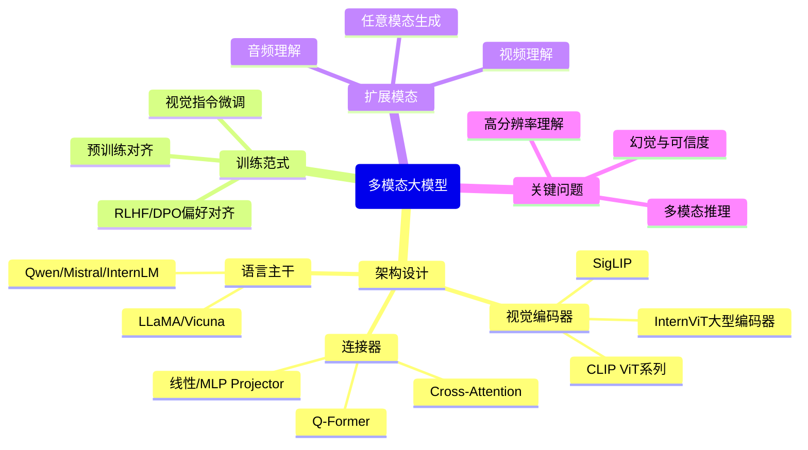

# 多模态大模型（Multimodal LLM）综述：技术路线、现状与展望

> 调研时间：2026-04，覆盖 2019–2026 年，综合 arXiv、NeurIPS/ICML/ICLR/CVPR/ECCV/ACL 顶会论文及 OpenAI/Google/Alibaba/上海 AI Lab 技术报告，共梳理 60+ 篇核心文献。

---

## 目录

- [1. 引言](#1-引言introduction)
- [2. 背景与基础](#2-背景与基础background)
- [3. 技术发展脉络](#3-技术发展脉络historical-overview)
- [4. 方法分类与详解](#4-方法分类与详解taxonomy--methods)
- [5. 数据工程](#5-数据工程data--training)
- [6. 评估基准](#6-评估基准benchmarks--evaluation)
- [7. 主流模型横向对比](#7-主流模型横向对比model-comparison)
- [8. 应用场景](#8-应用场景applications)
- [9. 开放问题与未来方向](#9-开放问题与未来方向open-problems--future-directions)
- [10. 结论](#10-结论conclusion)
- [附录 A：必读论文清单](#附录-a必读论文清单)
- [附录 B：资源汇总](#附录-b资源汇总)

---

## 1. 引言（Introduction）

### 1.1 背景与动机

人类感知世界天然是多模态的——视觉、语言、声音、触觉共同构成认知的基础。然而，早期 AI 系统长期以单一模态为中心：图像分类模型只看图，语言模型只读文本，语音识别系统只处理音频。多模态大模型（Multimodal Large Language Model，MLLM，也称多模态基础模型）的出现，是 AI 迈向"通用感知"的关键一步——它能同时理解并生成文本、图像、音频、视频等多种模态的内容，使模型与人类的交互方式发生质的飞跃。

**为什么是现在？** 三股技术浪潮汇聚催生了这一方向：
1. **大规模预训练范式的成熟**：GPT-3（2020）、BERT（2018）等工作证明了在海量数据上预训练的 Transformer（转换器）模型具备强大的迁移能力，这一范式随即被推广到视觉领域（ViT，2021）和跨模态领域（CLIP，2021）。
2. **指令微调（Instruction Tuning）的突破**：GPT-4（2023）和 LLaVA（2023）证明，通过高质量的视觉指令数据对预训练模型进行微调，可以显著解锁多模态对话能力，无需从头设计新架构。
3. **算力与数据的规模效应**：LAION-5B（58 亿图文对）等超大规模公开数据集，以及 GPU 集群算力的指数级增长，使训练千亿参数的多模态模型成为可能。

**工业界现状**：GPT-4o（OpenAI）、Gemini 1.5 Pro（Google DeepMind）、Claude 3.5 Sonnet（Anthropic）是当前闭源 MLLM 的代表；Qwen2-VL（Alibaba）、InternVL2（上海 AI Lab）是开源领域的旗帜。2024 年是多模态模型"开源追平闭源"的元年——Qwen2-VL-72B 在文档理解和 OCR 任务上已超越 GPT-4V。

### 1.2 本 Survey 范围

- **时间跨度**：2019（ViLBERT 奠基）至 2026 年 4 月
- **覆盖模态**：视觉（图像 + 视频）+ 语言 + 音频，重点是图文模态
- **覆盖子方向**：架构设计、训练范式、数据工程、幻觉问题、多模态生成、视频理解、音频理解、Benchmark 体系
- **不覆盖**：纯文本 LLM 进展、3D 点云专项、蛋白质结构预测等非主流模态

### 1.3 与已有综述的对比

| Survey | 年份 | 侧重点 | 与本文区别 |
|--------|------|--------|----------|
| **A Survey on Multimodal Large Language Models**（Yin et al., arXiv 2023）[arXiv:2306.13549] | 2023 | MLLM 架构与训练全览 | 本文覆盖至 2026，补充幻觉、视频、音频子方向 |
| **Multimodal Foundation Models: From Specialists to General-Purpose Assistants**（Xiao et al., arXiv 2023）[arXiv:2309.10020] | 2023 | 从专用到通用助手的演进 | 本文增加开源模型对比和工程实践 |
| **Vision-Language Models for Vision Tasks: A Survey**（Zhang et al., arXiv 2023）[arXiv:2304.00685] | 2023 | 聚焦判别式 VLM | 本文侧重生成式 MLLM |
| **A Survey on Hallucination in Large Vision-Language Models**（Bai et al., arXiv 2024）[arXiv:2402.00253] | 2024 | 专注幻觉问题 | 本文将幻觉作为子章节，视角更全面 |

---

## 2. 背景与基础（Background）

### 2.1 领域定义

多模态大模型的核心任务是：给定来自多个模态（图像 $v$、文本 $t$、音频 $a$ 等）的输入，生成目标模态的输出。形式化定义为：

$$
y = f_\theta(v_1, t_1, v_2, t_2, \ldots)
$$

其中输入为交错排列的多模态 token 序列，输出 $y$ 可以是文本回答、生成图像、语音等任意形式。

**核心挑战**：不同模态的信号空间差异巨大——图像是高维连续像素矩阵，文本是离散 token 序列，音频是时序波形。MLLM 的核心问题是**如何构建跨模态的统一表示空间**，使模型能在这个空间中进行跨模态推理。

### 2.2 基础技术栈

| 技术组件 | 说明 |
|---------|------|
| **Transformer**（Vaswani et al., NeurIPS 2017） | 所有 MLLM 的统一骨架，Self-Attention 机制天然支持变长序列 |
| **Vision Transformer（ViT）**（Dosovitskiy et al., ICLR 2021） | 将图像切分为 Patch（图块），线性投影为 token，首次将 Transformer 高效应用于视觉 |
| **CLIP**（Radford et al., ICML 2021） | 用 4 亿图文对做对比预训练（Contrastive Pretraining），学到强大的图文对齐表示，成为 MLLM 视觉编码器的事实标准 |
| **LLaMA / Qwen / Mistral** | 作为 MLLM 的语言主干（Language Backbone），提供强大的文本生成和推理能力 |
| **Instruction Tuning（指令微调）** | 用（指令, 响应）对微调预训练模型，使其具备对话和任务执行能力 |
| **RLHF / DPO** | 基于人类反馈的强化学习，用于对齐 MLLM 的输出风格与安全性 |

### 2.3 关键术语速查

| 术语（英文） | 中文 | 简要定义 |
|------------|------|---------|
| MLLM / LVLM | 多模态大模型 / 大型视觉语言模型 | 能处理图文等多种模态的大型模型 |
| Visual Encoder | 视觉编码器 | 将图像转换为向量表示的模块（通常是 ViT + CLIP） |
| Connector / Projector | 连接器 | 将视觉特征映射到语言模型 token 空间的桥接模块 |
| LLM Backbone | 语言主干 | MLLM 中负责理解和生成文本的语言模型部分 |
| Visual Instruction Tuning | 视觉指令微调 | 在（图像, 指令, 回答）三元组上微调的训练方式 |
| Hallucination | 幻觉 | 模型生成与图像内容不符的错误描述 |
| Grounding | 视觉定位/基础 | 将语言描述与图像中具体区域对应的能力 |
| OCR | 光学字符识别 | 识别图像中文字内容的能力 |
| Multimodal CoT | 多模态思维链 | 结合视觉信息的逐步推理过程 |
| Any-to-Any | 任意模态到任意模态 | 支持任意模态组合的输入/输出 |

---

## 3. 技术发展脉络（Historical Overview）

### 3.1 发展纪元

| 纪元 | 时间段 | 代表性工作 | 核心技术驱动 | 主要突破 | 遗留问题 |
|------|--------|-----------|------------|---------|---------|
| **VLP 奠基期** | 2019–2021 | ViLBERT, UNITER, Oscar, CLIP | BERT 范式移植视觉，区域特征 + 对比学习 | 确立图文预训练范式；CLIP 实现零样本视觉理解 | 依赖 Faster R-CNN 区域检测，推理慢；对话能力缺失 |
| **对齐起步期** | 2022–2023 Q1 | Flamingo, BLIP-2, MiniGPT-4 | 冻结预训练模型 + 轻量适配器 | 少量参数实现 LLM 视觉接入；视觉对话成为可能 | 幻觉严重；指令遵循弱；只会问答，不会细粒度理解 |
| **指令微调爆发期** | 2023 Q2–Q4 | LLaVA, InstructBLIP, Qwen-VL, mPLUG-Owl | 视觉指令数据 + MLP 连接器 | 开源 MLLM 百花齐放；多轮对话、OCR、细粒度理解 | 高分辨率支持不足；视频/音频理解弱；幻觉仍是问题 |
| **规模化与专业化** | 2024 | GPT-4o, InternVL2, Qwen2-VL, LLaVA-NeXT | 高分辨率、更大视觉编码器、视频支持 | 开源模型追上闭源；文档理解、数学推理大幅提升 | 长视频理解困难；原生音频支持匮乏；推理成本高 |
| **任意模态与原生多模态** | 2025– | GPT-4o（原生音频）, Gemini 2.0, Qwen2.5-VL | 统一 token 化、原生多模态训练 | 视觉+音频+工具调用统一；实时交互 | 多模态对齐的理论理解仍薄弱；评测体系滞后 |

### 3.2 关键里程碑时间线

- **2019 — ViLBERT**（Lu et al., NeurIPS 2019）[arXiv:1908.02265]：将 BERT 扩展为双流视觉-语言预训练模型，首次系统验证图文联合预训练的有效性，开创 VLP 时代。

- **2020 — UNITER / Oscar**（Chen et al., ECCV 2020 [arXiv:1909.11740]；Li et al., ECCV 2020 [arXiv:2004.06871]）：**UNITER: UNiversal Image-TExt Representation Learning** 用单流 Transformer 统一编码图文，**Oscar: Object Semantics Aligned Pre-training** 引入 object tag（物体标签）作为语义锚点，显著提升图文对齐质量。

- **2021 — CLIP**（Radford et al., ICML 2021）[arXiv:2103.00020]：**Learning Transferable Visual Models From Natural Language Supervision** 用 4 亿网络图文对做对比预训练，首次实现强大的零样本（zero-shot）图像分类。ViT 作为视觉编码器的主流地位由此确立，成为后续几乎所有 MLLM 的视觉骨架。

- **2021 — ViT**（Dosovitskiy et al., ICLR 2021）[arXiv:2010.11929]：**An Image is Worth 16x16 Words: Transformers for Image Recognition at Scale** 将图像切分为 Patch 并用 Transformer 处理，奠定视觉 Transformer 的基础架构，是所有后续视觉编码器的前身。

- **2022 — Flamingo**（Alayrac et al., NeurIPS 2022，DeepMind）[arXiv:2204.14198]：**Flamingo: a Visual Language Model for Few-Shot Learning** 通过 Perceiver Resampler 和 Cross-Attention 层将视觉特征插入冻结 LLM，实现 few-shot 视觉对话，是"大 LLM + 视觉适配器"范式的奠基之作。

- **2023 Q1 — BLIP-2**（Li et al., ICML 2023，Salesforce）[arXiv:2301.12597]：**BLIP-2: Bootstrapping Language-Image Pre-training with Frozen Image Encoders and Large Language Models** 引入 Q-Former（Querying Transformer，查询变换器），用 32 个可学习 query token 从视觉编码器中提取信息，大幅降低对齐训练成本，成为高效 MLLM 的标准范式之一。

- **2023 Q1 — MiniGPT-4**（Zhu et al., ICLR 2024）[arXiv:2304.10592]：**MiniGPT-4: Enhancing Vision-Language Understanding with Advanced Large Language Models** 仅用一个线性层连接 EVA-CLIP 和 Vicuna LLM，展示了极简连接器的有效性，推动开源 MLLM 大爆发。

- **2023 Q2 — LLaVA**（Liu et al., NeurIPS 2023）[arXiv:2304.08485]：**Visual Instruction Tuning** 视觉指令微调范式的奠基论文。用 GPT-4 生成的图文对话数据微调 LLaMA，以极低成本实现强大多模态对话，开启开源 MLLM 时代。

- **2023 Q3 — InstructBLIP**（Dai et al., NeurIPS 2023，Salesforce）[arXiv:2305.06500]：**InstructBLIP: Towards General Visual-Language Models with Instruction Tuning** 在 BLIP-2 基础上引入指令感知的 Q-Former，支持多种 LLM 后端，成为指令微调 VLM 的重要基线。

- **2023 Q3 — Qwen-VL**（Bai et al., arXiv 2023，Alibaba）[arXiv:2308.12966]：**Qwen-VL: A Versatile Vision-Language Model's Large Language Model** 支持中英双语、高分辨率（448×448）、细粒度视觉定位，是第一个在中文多模态任务上有竞争力的开源模型。

- **2023 Q4 — LLaVA-1.5**（Liu et al., CVPR 2024）[arXiv:2310.03744]：**Improved Baselines with Visual Instruction Tuning** 将线性 Projector 替换为 MLP，采用 ShareGPT4V 高质量指令数据，以 7B/13B 参数在 11 个 benchmark 上达到开源 SOTA，确立 MLP Connector 为主流选择。

- **2024 Q1 — LLaVA-NeXT（LLaVA-1.6）**（Liu et al., arXiv 2024）[arXiv:2310.03744（延伸）]：**LLaVA-NeXT: Improved reasoning, OCR, and world knowledge** 引入动态高分辨率策略，将图像切分为多个 Tile，支持最高 672×672 分辨率，显著改善 OCR 和细粒度视觉推理。

- **2024 Q2 — InternVL-1.5**（Chen et al., CVPR 2024，上海 AI Lab）[arXiv:2404.16821]：**InternVL: Scaling up Vision Foundation Models and Aligning for Generic Visual-Linguistic Tasks** 采用 InternViT-6B 作为视觉编码器（6B 参数，远大于 CLIP ViT-L 的 307M），在 MMBench、MMMU 等核心 benchmark 上逼近 GPT-4V 水平，证明强大视觉编码器的重要性。

- **2024 Q3 — GPT-4o**（OpenAI Technical Report，2024）[https://openai.com/index/hello-gpt-4o/]：首个原生支持文本、图像、音频端到端处理的商业模型，实时语音对话能力引发广泛关注，标志着多模态 AI 进入"原生融合"阶段。

- **2024 Q4 — Qwen2-VL**（Wang et al., arXiv 2024，Alibaba）[arXiv:2409.12191]：**Qwen2-VL: Enhancing Vision-Language Model's Perception of the World at Any Resolution** 引入 Naive Dynamic Resolution（动态分辨率）和 Multimodal Rotary Position Embedding（多模态旋转位置编码），72B 版本在 DocVQA（96.5%）、TextVQA（95.7%）上超越 GPT-4V，开源模型首次在核心任务上全面超越闭源旗舰。

- **2024 Q4 — InternVL2.5**（Chen et al., arXiv 2024，上海 AI Lab）[arXiv:2412.05271]：**Expanding Performance Boundaries of Open-Source Multimodal Models with Model, Data, and Test-Time Scaling** 在 InternVL2 基础上改进多图像推理和视频理解，78B 版本在 MMMU-Pro 上达到 53.4%，与 Claude 3.5 Sonnet 并驾齐驱。

- **2025 Q1 — Qwen2.5-VL**（Bai et al., arXiv 2025，Alibaba）[arXiv:2502.13923]：**Qwen2.5-VL Technical Report** 支持 UI 导航、视觉 Agent 任务，72B 版本 MMBench 达 88+，进一步巩固开源 MLLM 的领先地位。

---

## 4. 方法分类与详解（Taxonomy & Methods）

### 4.1 全局分类框架



### 4.2 架构设计：视觉编码器（Visual Encoder）

**核心思想**：视觉编码器将图像从像素空间映射到高维语义向量空间，其质量直接决定模型的视觉感知上限。

**主流方案演进**：

| 编码器 | 参数量 | 预训练方式 | 分辨率 | 代表模型 | 特点 |
|--------|--------|----------|--------|---------|------|
| CLIP ViT-L/14 | 307M | 对比学习（4 亿对） | 224 / 336px | LLaVA-1.5, MiniGPT-4 | 速度快，语义对齐好，但细节分辨率受限 |
| EVA-CLIP ViT-g | 1.8B | 对比 + 重建 | 224px | InstructBLIP, MiniGPT-4 | 更大参数，细粒度特征更强 |
| SigLIP | 400M–4B | Sigmoid loss（无对比批次限制） | 256–512px | PaliGemma | 训练更稳定，低分辨率也表现优秀 |
| InternViT-6B | 6B | 对比 + 监督 | 448px | InternVL 系列 | 目前最大开源视觉编码器，细节理解能力强 |
| CLIP ViT-bigG | 2.5B | 对比学习 | 448px | Qwen-VL / Qwen2-VL | 高分辨率支持好，中文场景优化 |

**技术演进逻辑**：早期（2021-2022）以 CLIP ViT-L 为标配，胜在速度与泛化；2023 年后向大参数编码器（EVA-CLIP-g）迁移以提升细节；2024 年出现"分辨率即质量"的共识，高分辨率编码与 Tile 切分策略成为 SOTA 标配；InternVL 系列证明视觉编码器参数量本身是关键 scaling 因素。

**局限性**：独立预训练的视觉编码器可能与语言模型存在语义空间不对齐问题；超高分辨率（>1024px）会产生大量视觉 token，增加 LLM 的计算负担。

### 4.3 架构设计：连接器（Connector / Projector）

**核心思想**：连接器是视觉编码器与语言模型之间的"翻译层"，负责将视觉特征映射到语言 token 空间，使 LLM 能"读懂"图像特征。

**三种主流方案对比**：

| 连接器类型 | 代表工作 | 可学习参数 | 视觉 token 数 | 核心机制 | 优点 | 缺点 |
|-----------|---------|-----------|-------------|---------|------|------|
| **线性 Projector / MLP** | LLaVA, MiniGPT-4 | 极少（~M 级） | 与 patch 数相同（256-576） | 直接线性/MLP 映射 | 简单高效，LLaVA-1.5 证明 MLP > Q-Former | 无法压缩 token，LLM 压力大 |
| **Q-Former** | BLIP-2, InstructBLIP | ~188M | 固定少量（32 个） | 可学习 query 通过 cross-attention 查询视觉特征 | 大幅压缩视觉 token，LLM 输入短 | 可能丢失细节；训练复杂 |
| **Perceiver Resampler** | Flamingo, IDEFICS | ~21M | 固定（64 个） | 将视觉特征池化为固定数量的 latent token | 支持任意分辨率输入 | 信息压缩损失；不如 MLP 在精细任务上表现好 |

**关键结论**：**Improved Baselines with Visual Instruction Tuning**（Liu et al., CVPR 2024）[arXiv:2310.03744] 做了系统性消融实验，发现 MLP Connector 在精细粒度任务（OCR、VQA）上优于 Q-Former，原因是 MLP 保留了完整的视觉 patch 特征，无信息损失。这一结论推动 2024 年主流开源 MLLM 集体转向 MLP Projector。

**局限性**：所有连接器方案都面临"如何在保留视觉细节的同时控制 token 数量"的核心矛盾，高分辨率图像可能产生 1000+ 视觉 token，消耗大量 LLM 上下文窗口。

### 4.4 训练范式（Training Paradigms）

**标准三阶段训练流程**（以 LLaVA-1.5 为代表）：

```
阶段 1：预训练对齐（Feature Alignment Pre-training）
  ├── 冻结：视觉编码器 + LLM
  ├── 训练：Connector（连接器）
  ├── 数据：~600K 图文对（CC3M 子集、LAION 子集）
  └── 目标：让连接器学会将视觉特征映射到 LLM 可理解的空间

阶段 2：视觉指令微调（Visual Instruction Tuning）
  ├── 冻结：视觉编码器（可选：解冻部分层）
  ├── 训练：Connector + LLM
  ├── 数据：~665K 图文指令对（LLaVA-Instruct、ShareGPT4V）
  └── 目标：使模型具备多轮对话、视觉问答、图像描述能力

阶段 3：偏好对齐（RLHF / DPO，可选）
  ├── 训练：全模型
  ├── 数据：人工标注的偏好对比对（chosen vs rejected）
  └── 目标：减少幻觉，提升指令遵循和安全性
```

**2024 年新趋势**：
- **高分辨率 Tile 策略**（LLaVA-NeXT、InternVL2）：将高分辨率图像切分为多个 Tile（图块），每个 Tile 单独编码后拼接，支持最高 4K 分辨率输入，OCR 准确率显著提升
- **课程学习（Curriculum Learning）**：Qwen2-VL 用低分辨率数据预热，逐步引入高分辨率，训练更稳定
- **多模态思维链（Multimodal CoT）**：如 LLaVA-CoT（2024），在生成最终答案前强制生成思维链，复杂推理任务提升明显

### 4.5 幻觉问题（Hallucination）

幻觉（Hallucination）是指 MLLM 生成与图像内容不符的描述，是影响多模态模型可信度的核心挑战。

**幻觉类型**：
- **对象幻觉（Object Hallucination）**：描述图中不存在的物体（最常见）
- **属性幻觉**：错误描述存在物体的颜色、数量、位置等属性
- **关系幻觉**：错误描述物体间的空间或语义关系

**成因分析**：
1. **语言先验过强**：LLM 倾向于生成符合语言统计规律的描述，即使图像证据不支持
2. **视觉接地弱（Weak Visual Grounding）**：模型无法精确将语言 token 与图像区域对应
3. **训练数据质量**：指令数据中存在噪声标注

**主流缓解方案**：

| 方法 | 论文 | 方式 | 效果 |
|------|------|------|------|
| RLHF-V | **RLHF-V: Aligning Large Multimodal Models from Human Feedback**（Yu et al., ACL 2024）[arXiv:2312.00849] | 人类反馈偏好对齐 | POPE F1 从 ~85% 提升到 ~90% |
| OPERA | **OPERA: Alleviating Hallucination in Multi-Modal Large Language Models via Over-Trust Penalty and Retrospection-Allocation**（Huang et al., CVPR 2024）[arXiv:2311.17911] | 解码时惩罚过度信任注意力头 | CHAIR ↓ 约 20% |
| Visual Contrastive Decoding | **VCD: Mitigating Object Hallucinations in Large Vision-Language Models through Visual Contrastive Decoding**（Leng et al., CVPR 2024）[arXiv:2311.16922] | 对比有无视觉输入的解码差异 | 无需重训，POPE 提升 3-5pp |
| POVID | **POVID: Aligning and Prompting Everything All at Once for Universal Visual Perception**（Zhou et al., arXiv 2024）[arXiv:2402.04797] | DPO + 视觉扰动负样本 | CHAIR ↓ 22%，接近 RLHF-V |

**标准评测**：**POPE**（Li et al., EMNLP 2023）[arXiv:2305.10355]（Polling-based Object Probing Evaluation，轮询式对象存在性评测，yes/no 问题，三个难度子集：Random/Popular/Adversarial）；**CHAIR**（Rohrbach et al., EMNLP 2018）（Caption Hallucination Assessment with Image Relevance，衡量描述中幻觉对象比率）。

### 4.6 视频理解（Video Understanding）

**核心挑战**：视频是图像在时间维度的延伸，带来两个独特问题：**时序推理**（理解事件的先后顺序和因果关系）和**长视频处理**（有效压缩数千帧的信息）。

**主流方法**：

| 模型 | 年份 | 核心机制 | 时序理解 | 最大时长 |
|------|------|---------|---------|--------|
| VideoChat2（上海 AI Lab，2023） | 2023 | 时序 Q-Former + 指令微调 | 中等 | 短视频（<3 min） |
| Video-LLaVA（2023） | 2023 | 统一图像/视频表示，对齐前投影 | 基础帧采样 | 短视频 |
| PLLaVA（2024） | 2024 | 无参数池化聚合帧特征，消除时序冗余 | 好 | 中等（ActivityNet） |
| LongVA（2024） | 2024 | 长上下文 LLM + 高效帧压缩 | 较好 | ~15 min |
| Gemini 1.5 Pro（2024） | 2024 | 原生多模态，1M token 上下文 | 最强 | ~9.5 小时音频 / 长视频 |
| Qwen2-VL（2024） | 2024 | 动态分辨率 + 视频 3D RoPE | 强 | 支持小时级视频 |

**局限性**：开源模型在超过 5 分钟的长视频上仍显著弱于 Gemini；细粒度时间定位（"第 2 分 30 秒时发生了什么"）对所有模型仍是难题。

### 4.7 音频理解（Audio Understanding）

**发展路线**：从级联系统（ASR → 文本 → LLM）到端到端原生音频理解。

| 模型 | 机构 | 年份 | 方法 | 能力 |
|------|------|------|------|------|
| AudioPaLM 2 | Google Research | 2023 | PaLM-2 + AudioLM token 融合 | 语音翻译、保留说话人特征 |
| SALMONN | 清华/字节 | 2023 | Whisper + BEATs 双编码器 + Q-Former | 语音识别、音乐描述、环境声 |
| Qwen-Audio | Alibaba | 2024 | 统一音频编码器，30+ 任务联合训练 | 通用音频理解，中英双语强 |
| Gemini 1.5 Pro | Google DeepMind | 2024 | 原生多模态，音频作为一等公民 | 理解语气/情感，无需 ASR 中间步骤 |
| GPT-4o | OpenAI | 2024 | 原生端到端音频处理 | 实时语音对话，情感感知 |

**局限性**：开源音频多模态模型（SALMONN、Qwen-Audio）与 GPT-4o/Gemini 的原生音频理解仍有显著差距；音乐生成、音效合成等生成能力相对薄弱。

### 4.8 多模态生成：任意模态到任意模态（Any-to-Any Generation）

**目标**：构建能以任意模态为输入、生成任意模态输出的统一模型。

**两种技术路线**：

**路线 A：LLM + 扩散模型解码器**
- 代表：**NExT-GPT: Any-to-Any Multimodal LLM**（Wu et al., NUS, arXiv 2023）[arXiv:2309.05519]、**CoDi-2: In-Context Interleaved and Interactive Any-to-Any Generation**（Tang et al., arXiv 2023）[arXiv:2311.18775]
- 思路：LLM 负责跨模态推理和规划，输出生成信号传给对应模态的扩散模型（Stable Diffusion / AudioLDM）
- 优点：复用高质量扩散模型的生成能力
- 缺点：各模态解码器独立，系统复杂；多模态输出未必协调同步

**路线 B：统一 Token 化 + 自回归**
- 代表：**Unified-IO 2: Scaling Autoregressive Multimodal Models**（Lu et al., AI2, arXiv 2023）[arXiv:2312.17172]、**AnyGPT: Unified Multimodal LLM with Discrete Sequence Modeling**（Zhan et al., arXiv 2024）[arXiv:2402.12226]
- 思路：将所有模态（图像、文本、音频、视频）离散化为统一 token 空间，用单一 Transformer 做自回归生成
- 优点：架构极简，天然支持多模态交错输入/输出
- 缺点：图像/视频的离散 tokenization（如 VQ-VAE）质量还不如扩散模型；训练数据需求极大

**2025 年趋势**：Gemini 2.0 已实现文本+图像原生联合生成，路线 B 在工业界逐渐成为主流方向。

---

## 5. 数据工程（Data & Training）

### 5.1 核心预训练数据集

| 数据集 | 年份 | 规模 | 类型 | 特点 |
|--------|------|------|------|------|
| **CC3M**（Conceptual Captions） | 2018 | 3.3M 图文对 | 网络爬取 | 最早期大规模图文对，噪声较多 |
| **CC12M** | 2021 | 12M 图文对 | 网络爬取 | CC3M 扩展版，覆盖更广 |
| **WIT**（Wikipedia Image-Text） | 2021 | 37.6M | 维基百科 | 高质量百科图文，Google 提供 |
| **LAION-400M / 5B** | 2021–2022 | 4亿 / 58亿图文对 | 网络爬取 + CLIP 过滤 | 最大开源图文数据集，OpenCLIP 训练基础 |
| **DataComp-1B** | 2023 | 12.8B 候选，1.28B 筛选后 | 网络爬取 + 精细筛选 | 数据筛选策略竞赛基础，筛选后优于 LAION |
| **LLaVA-Instruct-150K** | 2023 | 150K | GPT-4 生成指令数据 | 开创视觉指令微调数据范式 |
| **ShareGPT4V** | 2023 | 100K | GPT-4V 生成描述 | 高质量图文描述，推动 LLaVA-1.5 SOTA |
| **InternVL-SFT** | 2024 | 数 M 级 | 多源混合 | InternVL 系列多任务微调数据 |

### 5.2 数据质量关键技术

**图文对过滤**：
- CLIP 相似度过滤（Score > 0.28）：去除语义不相关的图文对，DataComp 证明这是最有效的单一筛选策略
- 分辨率过滤：通常要求短边 > 64px
- 文本质量过滤：去除纯 URL、特殊字符超过阈值的样本

**指令数据合成**：
- LLaVA 范式：用 GPT-4 的纯文本推理能力，给定图像描述（caption）+ 目标框信息，生成对话和推理问答
- ShareGPT4V：直接用 GPT-4V 对图像生成高质量、细节丰富的描述，质量显著高于 LLaVA-Instruct

**关键发现**：数据质量 >> 数据数量。**ShareGPT4V: Improving Data Quality in Large Visual-Language Models**（Chen et al., arXiv 2023）[arXiv:2311.12793] 仅用 100K GPT-4V 生成的高质量描述数据，带来的性能提升超过直接将 LLaVA-Instruct 扩充到 665K 的效果。同样，**DataComp: In search of the next generation of training sets for image-text models**（Gadre et al., NeurIPS 2024）[arXiv:2304.14108] 系统比较了多种数据筛选策略，发现 CLIP 相似度过滤是最有效的单一策略。

### 5.3 训练范式最佳实践

基于 LLaVA-1.5、InternVL2、Qwen2-VL 的经验：
- **冻结视觉编码器**：预训练阶段冻结视觉编码器能稳定训练；指令微调阶段解冻部分或全部视觉编码器有助于提升细粒度理解
- **连接器预热不可省**：跳过预训练对齐阶段直接做指令微调会导致训练不稳定
- **高分辨率需要渐进式训练**：Qwen2-VL 从 256px 逐步升至 1024px，避免直接高分辨率训练的不稳定

---

## 6. 评估基准（Benchmarks & Evaluation）

### 6.1 核心 Benchmark

| Benchmark | 年份 | 评估维度 | 规模 | 特点 |
|-----------|------|---------|------|------|
| **VQAv2** | 2017 | 视觉问答 | 1.1M QA 对 | 早期标准，已趋饱和（GPT-4o >80%） |
| **GQA** | 2019 | 组合视觉推理 | 22M QA | 图场景图生成，需要结构化推理 |
| **TextVQA** | 2019 | 图像文字识别 + 问答 | 45K QA | 测试 OCR 结合理解能力 |
| **DocVQA** | 2020 | 文档理解 | 50K QA | 扫描文档问答，测试 OCR + 版面理解 |
| **MME** | 2023 | 感知 + 认知（14 个子任务） | 2800 分满分 | 覆盖 OCR、颜色、计数、数学等 |
| **MMBench** | 2023 | 20 个能力维度，中英双语 | ~3K 题 | CircularEval 减少猜题偏差 |
| **MMMU** | 2023 | 57 个大学学科 | 11.5K 题 | 最难的综合能力测试，人类专家 88.6% |
| **MathVista** | 2023 | 数学推理 + 视觉 | 6.1K 题 | 视觉数学推理，GPT-4o 63.8% |
| **HallusionBench** | 2023 | 幻觉测试 | ~1.1K | 专门测视觉幻觉问题 |
| **OCRBench** | 2023 | OCR 综合测试 | 1K | 测试文字识别全面能力 |
| **Video-MME** | 2024 | 视频理解多任务 | 2.7K 题 | 覆盖短/中/长视频，含字幕/无字幕 |
| **MMMU-Pro** | 2024 | MMMU 加强版 | 3.5K | 更难的多学科推理，GPT-4o 54.5% |

### 6.2 核心 Benchmark 上的性能对比（2024–2025）

| 模型 | MMBench-EN | MMMU（val） | MathVista | OCRBench | HallusionBench |
|------|-----------|-----------|----------|---------|--------------|
| GPT-4o（2024-05） | 83.4 | 69.1 | 63.8 | 736 | 55.0 |
| Claude 3.5 Sonnet | 79.7 | 70.4 | 61.6 | 788 | 49.9 |
| Gemini 1.5 Pro | 81.3 | 65.8 | 63.9 | 754 | 45.6 |
| **Qwen2-VL-72B**（开源） | 86.9 | 64.5 | 70.5 | **877** | 41.7 |
| **InternVL2.5-78B**（开源） | **88.3** | 70.1 | 72.3 | 839 | 55.3 |
| Qwen2.5-VL-72B（2025） | 88+ | 70+ | 74+ | 85+ | — |

> 注：数字来源——GPT-4o 数据来自 **GPT-4 Technical Report**（OpenAI, arXiv 2023）[arXiv:2303.08774] 及 **GPT-4o System Card**（OpenAI, 2024）；Claude 3.5 Sonnet 数据来自 **Claude 3 Model Card**（Anthropic, 2024）；Gemini 数据来自 **Gemini 1.5: Unlocking multimodal understanding across millions of tokens of context**（Google DeepMind, arXiv 2024）[arXiv:2403.05530]；Qwen2-VL 数据来自原始技术报告 [arXiv:2409.12191]；InternVL2.5 数据来自 [arXiv:2412.05271]。部分数字经 **OpenCompass Leaderboard**（open-compass.github.io）交叉验证，以各模型原始报告为准。

### 6.3 评测体系局限性

1. **数据污染风险**：主流 benchmark 数据已大量流传，模型训练集可能包含测试数据
2. **饱和问题**：VQAv2、TextVQA 已接近饱和（>95%），MMMU 在闭源模型上也快速逼近人类水平
3. **与真实能力的 gap**：Benchmark 难以覆盖真实场景中的模糊指令、长对话、工具调用等复杂情形
4. **评测标准不统一**：同一模型在不同评测框架下分数可能差异较大（如 GPT-4o 在不同 MMMU 评测实现上差 2-3pp）

---

## 7. 主流模型横向对比（Model Comparison）

### 7.1 代表性模型汇总

| 模型 | 机构 | 年份 | 视觉编码器 | 连接器 | LLM 主干 | 参数量 | 开源 |
|------|------|------|-----------|--------|---------|--------|------|
| **Flamingo-80B** | DeepMind | 2022 | NFNet | Perceiver Resampler | Chinchilla-70B | 80B | ❌ |
| **BLIP-2** | Salesforce | 2023 | EVA-CLIP-g | Q-Former | OPT-6.7B / FlanT5-XL | ~8B | ✅ |
| **LLaVA-1.5** | 威斯康星大学 | 2023 | CLIP ViT-L/14@336 | MLP-2 | Vicuna-7B/13B | 7B/13B | ✅ |
| **InstructBLIP** | Salesforce | 2023 | EVA-CLIP-g | Q-Former（指令感知） | Vicuna-7B/13B | 8B/14B | ✅ |
| **Qwen-VL** | Alibaba | 2023 | CLIP ViT-bigG | 1 层交叉注意力 | Qwen-7B | 9.6B | ✅ |
| **LLaVA-NeXT** | 威斯康星大学 | 2024 | CLIP ViT-L@336 + Tile | MLP-2 | Llama-3/Mistral | 7B–34B | ✅ |
| **InternVL-1.5** | 上海 AI Lab | 2024 | InternViT-6B | MLP | InternLM2-20B | 26B | ✅ |
| **GPT-4o** | OpenAI | 2024 | 未公开（原生） | 原生融合 | GPT-4 级别 | 未公开 | ❌ |
| **Gemini 1.5 Pro** | Google DeepMind | 2024 | 未公开（原生） | 原生融合 | Gemini-1.5 级别 | 未公开 | ❌ |
| **Qwen2-VL** | Alibaba | 2024 | CLIP ViT-bigG + 动态分辨率 | MLP + M-RoPE | Qwen2-7B/72B | 7B/72B | ✅ |
| **InternVL2.5** | 上海 AI Lab | 2024 | InternViT-6B + 动态 Tile | MLP | InternLM2.5/Llama-3 | 1B–78B | ✅ |
| **Claude 3.5 Sonnet** | Anthropic | 2024 | 未公开 | 原生融合 | Claude-3.5 级别 | ❌ |
| **Qwen2.5-VL** | Alibaba | 2025 | CLIP ViT-bigG + 动态 | MLP | Qwen2.5-3B/7B/72B | 3B/7B/72B | ✅ |

### 7.2 技术路线对比分析

**闭源 vs 开源**：2024 年是分水岭。Qwen2-VL-72B 在 OCR/文档任务全面超越 GPT-4V，InternVL2.5-78B 在 MMMU-Pro 上达到与 Claude 3.5 Sonnet 相当的水平。开源模型在推理密集型任务（MMMU）上仍有约 5pp 的差距，但差距在快速缩小。

**连接器路线**：Q-Former 派（BLIP-2、InstructBLIP）vs MLP 派（LLaVA 系列、InternVL、Qwen2-VL）的实践已有定论：MLP Projector + 高分辨率 Tile 是当前最优工程选择；Q-Former 的 token 压缩优势在 LLM 上下文窗口扩大后已不重要。

**规模 scaling**：视觉编码器参数量（InternViT-6B vs CLIP ViT-L 307M）和 LLM 参数量（72B vs 7B）均与性能正相关，但 7B 量级的模型（Qwen2-VL-7B、InternVL2-8B）在效率上具有极大优势，在大多数任务上超越 2023 年的 34B 模型。

### 7.3 性能演进趋势

以 MMMU（val）为例：
```
2023 Q2  LLaVA-1.5 13B      35.4%
2023 Q4  InstructBLIP 13B   40.7%
2024 Q1  LLaVA-NeXT 34B     51.1%
2024 Q2  InternVL-1.5 26B   46.8%
2024 Q3  GPT-4o              69.1%
2024 Q4  InternVL2.5-78B    70.1%
2025 Q1  Qwen2.5-VL-72B     70+%
         人类专家            88.6%
```
从 2023 年 35% 到 2025 年 70%，不到 2 年提升 35pp，年均提升近 20pp，是 AI 进展最快的方向之一。

---

## 8. 应用场景（Applications）

### 8.1 主要应用领域

**文档智能与 OCR**：MLLM 在复杂版面文档（PDF、扫描件、表格、图表）的理解上已达到商用水平。代表：Qwen2-VL 在 DocVQA 达 96.5%，接近人类水平。挑战：多页跨页理解、手写体识别仍弱。

**图像描述与视觉问答（VQA）**：最成熟的应用，GPT-4V/4o 等模型已可生成高质量图像描述并回答复杂视觉问题。广泛应用于无障碍辅助、内容理解。

**数学与科学推理**：MathVista 系列证明 MLLM 能读懂几何图形、函数图像、化学结构式并进行推理。GPT-4o/Claude 3.5 在医学影像初步诊断上展示出潜力。

**代码生成与 UI 理解**：Qwen2.5-VL 的 UI 导航能力（截图 → 操作指令）使其成为视觉 Agent 的重要基础，可自动化 Web/App 操作任务。

**视频内容分析**：短视频字幕生成、会议记录摘要（Gemini 1.5 Pro 原生支持 1 小时视频上传），新闻视频事件检测等。

**创意内容生成**：Any-to-Any 模型（NExT-GPT、Unified-IO 2）支持图文-音视频的创意组合，文图互生应用（DALL-E 3 接受描述 → 图像）已大规模商用。

### 8.2 工业落地现状

**已成熟**：文档处理、图像搜索/标注、辅助设计、内容审核

**快速发展中**：视觉 Agent（自动化 UI 操作）、医疗影像辅助诊断、教育场景（题目图像解析）

**主要落地障碍**：
- **推理成本**：72B 模型实时响应成本高，7B 量级效率更好
- **可靠性**：幻觉问题在医疗、法律等高风险场景仍是阻碍
- **隐私**：图像中包含个人信息（人脸、证件），合规要求严格

---

## 9. 开放问题与未来方向（Open Problems & Future Directions）

### 9.1 当前核心挑战

**1. 幻觉问题尚未根本解决**
- 问题：MLLM 在细粒度视觉理解任务中仍频繁生成与图像不符的内容
- 困难：语言先验和视觉证据的权衡在自回归解码中难以精确控制
- 现有尝试：RLHF-V、OPERA、对比解码；但这些方案在复杂场景下收益有限

**2. 长视频理解仍是天花板**
- 问题：超过 10 分钟的视频，所有开源模型表现明显下降
- 困难：帧数多导致 token 数爆炸；时序推理需要跨帧长程依赖
- 现有尝试：LongVA 的长上下文压缩、Gemini 1.5 的稀疏注意力；但时间定位精度仍差

**3. 多模态推理深度不足**
- 问题：现有 MLLM 在需要多步骤、结合视觉+逻辑+知识的复杂推理（如 MMMU-Pro）上远未达到人类水平
- 困难：视觉感知和语言推理的"分工"机制不透明，错误难以溯源
- 现有尝试：Multimodal CoT（LLaVA-CoT）、视觉 o1 式推理；仍处于早期

**4. 原生多模态对齐理论匮乏**
- 问题：为什么 MLP Projector 优于 Q-Former？视觉 token 在 LLM 内部如何被处理？目前缺乏系统性理论解释
- 困难：LLM 内部的多模态表示解释性极弱，设计决策多依赖经验

**5. 评测体系滞后于模型能力**
- 问题：主流 benchmark（MMMU、MMBench）已接近饱和，无法区分顶级模型
- 困难：设计能真实反映应用价值的评测难（如：能否帮医生看片？能否完成复杂文档审阅？）

### 9.2 有前景的研究方向

1. **多模态推理模型（Multimodal Reasoning Models）**：将 o1/R1 的 Chain-of-Thought 强化学习范式迁移到视觉模态，训练能做慢思考的视觉推理模型。2025 年已有 LLaVA-R1、Qwen-VL-Think 等早期探索。

2. **原生多模态统一架构**：完全统一的 token 化（图像/音频/视频 ↔ 离散 token），去除视觉编码器和 LLM 的模块分离，使多模态从"外挂功能"变为"原生能力"。Gemini 2.0 和未来的 GPT-5 可能走这条路线。

3. **高效小型多模态模型**：面向移动端/边缘设备的 1B-4B 量级 MLLM（MiniCPM-V、InternVL2-2B），在有限算力下保持合理性能，是工业落地的重要方向。

4. **多模态 Agent（Multimodal Agents）**：将 MLLM 作为感知层，构建能完成多步骤视觉操作任务的 Agent（Web 浏览、GUI 操作、机器人控制）。Qwen2.5-VL 的 UI 导航能力是这一方向的早期尝试。

5. **多模态对齐可解释性**：理解视觉 token 在 LLM 中的表示、揭示幻觉的内在机制，是提升可靠性和可信度的理论基础。

### 9.3 跨领域交叉机会

- **具身智能（Embodied AI）**：MLLM 作为机器人的"视觉大脑"，RT-2（Google）已证明 VLM 可以端到端指导机器人操作
- **医疗影像**：Med-Flamingo、LLaVA-Med 等证明 MLLM 在医学影像分析上的潜力，但可靠性是核心障碍
- **科学发现**：图表/公式理解 + 多轮推理，辅助科研文献分析

---

## 10. 结论（Conclusion）

多模态大模型在过去五年中走过了从"拼接视觉与语言"到"原生多模态感知与推理"的深刻演变。2019 年 ViLBERT 开创 VLP（Vision-Language Pretraining，视觉-语言预训练）范式，2021 年 CLIP 确立了对比学习 + 大规模网络数据的基础范式，2023 年 LLaVA 的视觉指令微调范式使开源 MLLM 大规模涌现，2024 年 GPT-4o 和 Qwen2-VL 则分别代表了闭源"原生融合"和开源"极致优化"的两条主线。

**技术格局**：当前 MLLM 的性能天花板由三个因素主导——视觉编码器质量（InternViT-6B 大幅优于 CLIP ViT-L）、连接器设计（MLP + 高分辨率 Tile 是工程最优解）、指令数据质量（高质量 GPT-4V 生成数据的价值已被充分证明）。开源模型在文档理解、OCR 等专项能力上已全面追平甚至超越闭源，但在复杂多步推理（MMMU-Pro）上仍有 5-10pp 的差距。

**最重要的开放问题**是幻觉、长视频理解和多模态深层推理。这三个问题本质上都指向同一个核心挑战：**如何让 MLLM 真正"看懂"图像并将视觉证据深度融入推理过程**，而非仅凭语言先验生成貌似合理的回答。

**展望未来**，多模态推理模型（视觉版 o1/R1）、统一原生架构、多模态 Agent 是三个最值得关注的方向。随着 2025 年 Qwen2.5-VL 和未来模型的迭代，可以预期在 2026 年前，开源 MLLM 将在绝大多数标准 benchmark 上与闭源旗舰模型持平，领域竞争将从"benchmark 数字"转向"真实场景有效性"。

---

## 附录 A：必读论文清单

### A.1 入门必读（7 篇）

| 论文 | 第一作者 | 机构/年份 | 一句话 | arXiv |
|------|---------|---------|--------|-------|
| **Learning Transferable Visual Models From Natural Language Supervision（CLIP）** | Radford et al. | OpenAI, ICML 2021 | 4 亿图文对比预训练，零样本视觉理解奠基 | 2103.00020 |
| **Flamingo: a Visual Language Model for Few-Shot Learning** | Alayrac et al. | DeepMind, NeurIPS 2022 | LLM + 视觉适配器的 few-shot 对话范式 | 2204.14198 |
| **BLIP-2: Bootstrapping Language-Image Pre-training with Frozen Image Encoders and LLMs** | Li et al. | Salesforce, ICML 2023 | Q-Former 高效连接视觉与 LLM | 2301.12597 |
| **Visual Instruction Tuning（LLaVA）** | Liu et al. | 威斯康星大学, NeurIPS 2023 | 视觉指令微调范式奠基，开启开源 MLLM 时代 | 2304.08485 |
| **Improved Baselines with Visual Instruction Tuning（LLaVA-1.5）** | Liu et al. | 威斯康星大学, CVPR 2024 | MLP Connector + 高质量数据，开源 SOTA 分水岭 | 2310.03744 |
| **InternVL: Scaling up Vision Foundation Models（InternVL-1.5）** | Chen et al. | 上海 AI Lab, CVPR 2024 | 大视觉编码器 InternViT-6B，逼近 GPT-4V | 2404.16821 |
| **Qwen2-VL: Enhancing Vision-Language Model's Perception of the World at Any Resolution** | Wang et al. | Alibaba, arXiv 2024 | 动态分辨率 + M-RoPE，开源首超 GPT-4V 的里程碑 | 2409.12191 |

### A.2 深入研究（按子方向，15 篇）

**架构演进**
- **ViLBERT: Pretraining Task-Agnostic Visiolinguistic Representations**（Lu et al., NeurIPS 2019）[arXiv:1908.02265] — VLP 起点，双流 Transformer
- **UNITER: UNiversal Image-TExt Representation Learning**（Chen et al., ECCV 2020）[arXiv:1909.11740] — 单流 VLP，ITM + MLM + WRA 预训练目标
- **InstructBLIP: Towards General Visual-Language Models with Instruction Tuning**（Dai et al., NeurIPS 2023）[arXiv:2305.06500] — 指令感知 Q-Former
- **Qwen-VL: A Versatile Vision-Language Model's Large Language Model**（Bai et al., arXiv 2023）[arXiv:2308.12966] — 首个强中文多模态开源模型

**幻觉与可信度**
- **Evaluating Object Hallucination in Large Vision-Language Models（POPE）**（Li et al., EMNLP 2023）[arXiv:2305.10355] — 幻觉评测标准 benchmark
- **RLHF-V: Aligning Large Multimodal Models from Human Feedback**（Yu et al., ACL 2024）[arXiv:2312.00849] — 偏好对齐减少幻觉
- **OPERA: Alleviating Hallucination via Over-Trust Penalty and Retrospection-Allocation**（Huang et al., CVPR 2024）[arXiv:2311.17911] — 解码策略减少幻觉

**视频与音频**
- **MVBench: A Comprehensive Multi-modal Video Understanding Benchmark（含 VideoChat2）**（Li et al., CVPR 2024）[arXiv:2311.17005] — 视频指令微调，MVBench 评测
- **PLLaVA: Parameter-free LLaVA Extension from Images to Videos**（Xu et al., arXiv 2024）[arXiv:2404.16994] — 无参数池化视频理解
- **SALMONN: Towards Generic Hearing Abilities for Large Language Models**（Tang et al., arXiv 2023）[arXiv:2310.13289] — 通用音频理解 LLM
- **Qwen-Audio: Advancing Universal Audio Understanding via Unified Large-Scale Audio-Language Models**（Chu et al., arXiv 2023）[arXiv:2311.07919] — 多任务音频 LLM

**多模态生成**
- **NExT-GPT: Any-to-Any Multimodal LLM**（Wu et al., NUS, arXiv 2023）[arXiv:2309.05519] — 首个端到端 any-to-any MLLM
- **Unified-IO 2: Scaling Autoregressive Multimodal Models with Vision, Language, Audio, and Action**（Lu et al., AI2, arXiv 2023）[arXiv:2312.17172] — 统一 token 化多模态自回归

**数据工程**
- **DataComp: In search of the next generation of training sets for image-text models**（Gadre et al., NeurIPS 2024）[arXiv:2304.14108] — 数据筛选策略系统研究
- **ShareGPT4V: Improving Data Quality in Large Visual-Language Models**（Chen et al., arXiv 2023）[arXiv:2311.12793] — GPT-4V 生成高质量描述数据

### A.3 前沿追踪（2024–2025）

- **InternVL2.5**（上海 AI Lab, 2024）— 78B 开源 MLLM，MMMU-Pro 53.4%
- **Qwen2.5-VL**（Alibaba, 2025）— 支持视觉 Agent，UI 导航
- **LLaVA-CoT**（2024）— 多模态思维链强化推理
- **Gemini 2.0 Flash/Pro**（Google DeepMind, 2025）— 原生多模态输出，实时音视频

---

## 附录 B：资源汇总

| 类型 | 名称 | 链接 | 说明 |
|------|------|------|------|
| 评测框架 | VLMEvalKit | github.com/open-compass/VLMEvalKit | 开源多模态评测，覆盖 50+ benchmark |
| Leaderboard | OpenCompass | opencompass.org.cn/leaderboard-multimodal | 多模态模型排行榜，持续更新 |
| Leaderboard | Open VLM Leaderboard | huggingface.co/spaces/opencompass/open_vlm_leaderboard | HuggingFace 上的开源 VLM 排行 |
| 开源模型 | InternVL | github.com/OpenGVLab/InternVL | InternVL 系列全系开源 |
| 开源模型 | Qwen2-VL | github.com/QwenLM/Qwen2-VL | Qwen2-VL 模型与代码 |
| 开源框架 | LLaVA | github.com/haotian-liu/LLaVA | LLaVA 系列开源实现 |
| Benchmark | MMMU | mmmu-benchmark.github.io | 大学级多模态理解评测 |
| Benchmark | Video-MME | video-mme.github.io | 视频多模态综合评测 |
| 资源列表 | Awesome-MLLM | github.com/BradyFU/Awesome-Multimodal-Large-Language-Models | 多模态 LLM 论文/资源汇总 |
