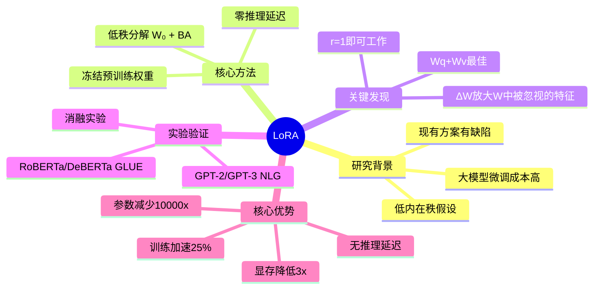

# LoRA: Low-Rank Adaptation of Large Language Models

## 基本信息
- **标题**: LoRA: Low-Rank Adaptation of Large Language Models
- **作者**: Edward Hu, Yelong Shen, Phillip Wallis, Zeyuan Allen-Zhu, Yuanzhi Li, Shean Wang, Lu Wang, Weizhu Chen
- **机构**: Microsoft Corporation
- **发表时间**: ICLR 2022 (Version 2)
- **论文链接**: 本地PDF / [arXiv](https://arxiv.org/abs/2106.09685)
- **代码链接**: https://github.com/microsoft/LoRA

## 一、研究背景与动机

### 问题背景
大语言模型的训练范式通常是：大规模预训练 + 下游任务微调。然而，随着模型规模增大（如GPT-3 175B），全量微调变得不切实际：
- **存储成本**：每个下游任务需要存储完整的175B参数副本
- **部署困难**：多个独立微调模型的部署极其昂贵
- **计算开销**：需要维护所有参数的优化器状态

### 现有方案的局限
1. **Adapter Layers**：在Transformer层间插入额外模块
   - 引入推理延迟（在线推理场景延迟增加可达30%）
   - 需要顺序计算，无法利用硬件并行性

2. **Prefix Tuning**：优化输入层激活
   - 难以优化，性能变化非单调
   - 占用可用序列长度，限制任务处理能力

### 研究动机
受 Li et al. (2018a) 和 Aghajanyan et al. (2020) 启发：过参数化模型实际上存在于低内在维度上。**假设：模型适应过程中的权重更新也具有低"内在秩"**。

## 二、核心贡献

1. **提出LoRA方法**：冻结预训练权重，注入可训练的低秩分解矩阵
2. **大幅降低参数量**：GPT-3 175B上可减少10,000倍可训练参数
3. **显著降低显存**：GPU显存需求降低3倍（1.2TB → 350GB）
4. **零推理延迟**：权重可合并，不引入额外推理开销
5. **实证研究**：深入分析低秩更新的性质，揭示语言模型适应的本质

## 三、方法详解

### 3.1 核心思想

对于预训练权重矩阵 W₀ ∈ ℝ^(d×k)，约束其更新为低秩分解：

$$W = W_0 + \Delta W = W_0 + BA$$

其中：
- B ∈ ℝ^(d×r)，A ∈ ℝ^(r×k)
- r ≪ min(d, k)，秩r远小于原矩阵维度
- W₀ 冻结，A和B包含可训练参数

**前向传播**：
$$h = W_0 x + \Delta W x = W_0 x + BAx$$

### 3.2 初始化策略

- **A**：随机高斯初始化，A ~ N(0, σ²)
- **B**：零初始化，确保训练开始时 ΔW = BA = 0

**缩放因子**：输出乘以 α/r（α为超参），减少调参需求。

### 3.3 应用到Transformer

论文主要关注Transformer自注意力模块的权重矩阵：
- Wq, Wk, Wv, Wo（自注意力）
- MLP模块冻结

**实验发现**：同时适应 Wq 和 Wv 效果最佳。

### 3.4 关键优势

1. **参数共享**：一个预训练模型可服务多个任务
2. **训练效率**：无需计算冻结参数的梯度，训练速度提升25%
3. **零推理延迟**：部署时将BA合并到W₀，推理与微调模型完全相同
4. **任务切换**：通过替换A、B矩阵即可切换任务

## 四、实验设计与结果

### 4.1 实验设置

**测试模型**：RoBERTa (base/large)、DeBERTa (XXL)、GPT-2 (medium/large)、GPT-3 (175B)

**评估任务**：
- NLU：GLUE基准（MNLI, SST-2, MRPC, CoLA, QNLI, QQP, RTE, STS-B）
- NLG：E2E NLG Challenge、WebNLG、DART
- 大规模：WikiSQL、SAMSum

### 4.2 RoBERTa & DeBERTa 结果

| 模型 | 方法 | 可训练参数 | GLUE平均 |
|------|------|-----------|---------|
| RoBERTa base | Fine-Tune | 125M | 86.4 |
| RoBERTa base | LoRA | 0.3M | **87.2** |
| RoBERTa large | Fine-Tune | 355M | 88.9 |
| RoBERTa large | LoRA | 0.8M | **89.0** |
| DeBERTa XXL | Fine-Tune | 1500M | 91.1 |
| DeBERTa XXL | LoRA | 4.7M | **91.3** |

### 4.3 GPT-2 & GPT-3 结果

**GPT-2 E2E NLG**：
| 模型 | 方法 | 参数 | BLEU | ROUGE-L |
|------|------|------|------|---------|
| GPT-2 M | Fine-Tune | 355M | 68.2 | 71.0 |
| GPT-2 M | LoRA | 0.35M | **70.4** | **71.8** |

**GPT-3 175B**：
| 方法 | 参数 | WikiSQL | MNLI | SAMSum R-1/R-2/RL |
|------|------|---------|------|-------------------|
| Fine-Tune | 175B | 73.8 | 89.5 | 52.0/28.0/44.5 |
| Adapter | 40M | 73.2 | 91.5 | 53.2/29.0/45.1 |
| LoRA | 4.7M | **73.4** | **91.7** | **53.8/29.8/45.9** |

### 4.4 消融实验

**选择哪些权重矩阵应用LoRA**（固定18M参数预算）：
| 权重类型 | WikiSQL | MNLI |
|---------|---------|------|
| Wq only | 70.4 | 91.0 |
| Wv only | 73.0 | 91.0 |
| Wq, Wv | **73.7** | **91.7** |

**秩r的影响**：
| r | Wq only | Wq, Wv |
|---|---------|--------|
| 1 | 68.8 | 73.4 |
| 2 | 69.6 | 73.3 |
| 4 | 70.5 | 73.7 |
| 8 | 70.4 | 73.8 |
| 64 | 70.0 | 73.5 |

**惊人发现**：r=1 对 {Wq, Wv} 已经表现良好！

## 五、关键创新点

### 5.1 理论洞察

**子空间相似性分析**：
- 不同r值学到的低秩矩阵，其top奇异向量方向高度重叠
- 不同随机种子训练的模型，主要共享前几个奇异方向
- 说明适应矩阵ΔW确实具有极低的"内在秩"

### 5.2 ΔW 与 W 的关系

通过投影分析发现：
1. ΔW 与 W 有相关性（比随机矩阵强）
2. ΔW 不是重复W的top方向，而是**放大W中未被强调的方向**
3. 放大因子巨大：约21.5倍（r=4时）

**核心发现**：低秩适应矩阵潜在地**放大了预训练模型中已学习但未强调的下游任务重要特征**。

### 5.3 与其他方法的本质区别

| 方法 | 权重更新 | 推理延迟 | 序列长度 |
|------|---------|---------|---------|
| Full Fine-tuning | 全量 | 无 | 完整 |
| Adapter | 瓶颈层 | 有 | 完整 |
| Prefix Tuning | 输入嵌入 | 无 | 受限 |
| **LoRA** | 低秩分解 | 无 | 完整 |

## 六、局限性与未来工作

### 局限性
1. **批量限制**：不同任务的输入难以在单次前向传播中批量处理（若权重已合并）
2. **任务依赖**：极端任务（如不同语言）可能需要更大的r
3. **模块选择**：主要基于启发式选择应用LoRA的权重矩阵

### 未来方向
1. 与其他高效适应方法结合（如prefix tuning）
2. 深入研究微调机制：预训练特征如何转化为下游任务能力
3. 更有原则性的权重矩阵选择方法
4. W的秩亏问题研究

## 七、个人思考

### 方法本质
LoRA的成功揭示了语言模型适应的本质：**下游任务所需的"知识"可能已经存在于预训练模型中，只需要通过低秩变换"引导"出这些能力**。这解释了为什么r=1这样极低的秩就能工作。

### 与全量微调的关系
LoRA是全量微调的一种约束形式，当r = d时，理论上可以恢复全量微调的表达能力。实验表明，对于大多数任务，极低的r就够了，说明模型参数中存在大量冗余。

### 实践启示
1. **资源受限场景首选**：个人开发者、小团队都能轻松微调大模型
2. **多任务部署**：一份基座模型 + 多个小LoRA模块，极大降低存储和切换成本
3. **快速迭代**：参数量小，实验周期短，便于快速验证想法

### 与后续工作的联系
LoRA开启了PEFT（Parameter-Efficient Fine-Tuning）的研究热潮，后续涌现大量工作：
- **QLoRA**：量化 + LoRA，进一步降低显存
- **LongLoRA**：扩展到长上下文场景
- **AdaLoRA**：自适应调整不同层的秩
- **LoRA+**：改进初始化和学习率策略

## 脑图结构



## 相关论文

1. **Intrinsic Dimensionality** - Aghajanyan et al. (2020): 揭示预训练模型存在低内在维度
2. **Adapter** - Houlsby et al. (2019): 早期参数高效微调方法
3. **Prefix Tuning** - Li & Liang (2021): 基于前缀的微调方法
4. **BitFit** - Zaken et al. (2021): 仅训练偏置项
5. **QLoRA** - Dettmers et al. (2023): 量化LoRA
6. **LongLoRA** - Chen et al. (2023): 长上下文LoRA扩展

## 参考文献

```bibtex
@article{hu2022lora,
  title={LoRA: Low-Rank Adaptation of Large Language Models},
  author={Hu, Edward J and Shen, Yelong and Wallis, Phillip and Allen-Zhu, Zeyuan and Li, Yuanzhi and Wang, Shean and Wang, Lu and Chen, Weizhu},
  journal={ICLR},
  year={2022}
}
```

---

*阅读日期: 2025-03-23*
