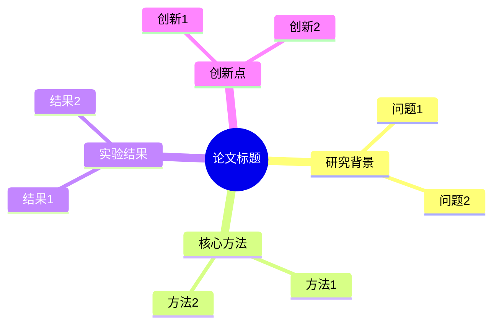

# 论文阅读笔记生成器

根据用户提供的论文生成完整的阅读笔记。

## 输入参数
- `$ARGUMENTS`: 论文来源，支持两种格式：
  - 本地 PDF 文件路径（如 `/path/to/paper.pdf`）
  - 远程论文链接（如 `https://arxiv.org/abs/xxxx.xxxxx`）

## 执行步骤

### 1. 获取论文内容

#### 如果是本地 PDF 路径：

**推荐方式：使用 pymupdf4llm（推荐）**

```python
import pymupdf4llm

pdf_path = "论文路径"
md_text = pymupdf4llm.to_markdown(pdf_path, write_images=True, image_path="images/论文标题")
```

pymupdf4llm 的优势：
- 将 PDF 转换为结构化 Markdown
- 自动提取论文内嵌图片
- 保留表格、公式等格式

**备选方式：使用 pymupdf (fitz) 提取文本**

```python
import fitz

doc = fitz.open(pdf_path)
for page in doc:
    text = page.get_text()
    # 处理文本
```

#### 如果是远程链接：
- 使用 WebFetch 获取论文页面内容
- 支持 arXiv、OpenReview、ACL、NeurIPS、ICML 等常见论文来源

### 2. 图片处理（可选）

> ⚠️ **注意**：根据实际使用反馈，提取的图片通常信息量较低，建议**默认不提取图片**，仅生成纯文字笔记。如果用户明确需要图片，再执行以下步骤。

#### 使用 pymupdf4llm 提取论文内嵌图片

```python
import pymupdf4llm
import os

output_dir = "images/论文标题/pymupdf4llm"
os.makedirs(output_dir, exist_ok=True)

md_text = pymupdf4llm.to_markdown(pdf_path, write_images=True, image_path=output_dir)
```

#### 使用 pymupdf 渲染页面为图片（如果需要完整页面）

```python
import fitz
import os

output_dir = "images/论文标题/pages"
os.makedirs(output_dir, exist_ok=True)

doc = fitz.open(pdf_path)
key_pages = [1, 2, 3, 4, 5, 6, 7, 8]  # 关键页面

for page_num in key_pages:
    page = doc[page_num - 1]
    mat = fitz.Matrix(2, 2)  # 2x 缩放
    pix = page.get_pixmap(matrix=mat)
    pix.save(f"{output_dir}/page_{page_num:02d}.png")
```

### 3. 生成论文笔记文件

在项目根目录创建论文笔记文件，**文件命名规范**：

```
{年月}-{论文简称}-{第一作者姓}-{第一机构简称}.md
```

**命名示例**：
- `202106-LoRA-Hu-Microsoft.md` → 2021年6月，LoRA，作者Hu，机构Microsoft
- `202311-DPO-Rafailov-Stanford.md` → 2023年11月，DPO，作者Rafailov，机构Stanford
- `202212-CAI-Bai-Anthropic.md` → 2022年12月，Constitutional AI，作者Bai，机构Anthropic

**命名规则**：
- **年月**：论文首次发布（arXiv）或发表（会议）的时间，格式 YYYYMM
- **论文简称**：论文核心方法的简称，如 LoRA、DPO、PPO 等
- **第一作者姓**：论文第一作者的姓氏
- **第一机构简称**：第一作者所属机构的简称，如 Microsoft、Stanford、Anthropic、OpenAI 等

文件内容包含以下部分：

#### 文件结构模板：

```markdown
# {论文标题}

## 基本信息
- **标题**: {原标题}
- **作者**: {作者列表}
- **机构**: {作者所属机构}
- **发表时间**: {年份/会议}
- **论文链接**: {链接，如果是本地文件则标注"本地PDF"}

## 一、研究背景与动机
{分析论文的研究背景、解决什么问题、为什么重要}

## 二、核心贡献
{列举论文的3-5个核心贡献点}

## 三、方法详解
{详细解释论文的核心方法，包括算法设计、模型架构等}

## 四、实验设计与结果
{描述实验设置、数据集、基线对比、主要实验结果}

## 五、关键创新点
{提炼论文最有价值的技术创新}

## 六、局限性与未来工作
{论文指出的局限性和未来研究方向}

## 七、个人思考
{待填写：阅读后的个人思考、启发、与相关工作的联系}

## 脑图结构



> 💡 **提示**：可将上述 Mermaid 代码粘贴到 [Mermaid Live Editor](https://mermaid.live/) 或支持 Mermaid 的编辑器中查看

## 相关论文
{列出相关的论文，方便后续阅读}

## 参考文献
{论文引用的主要参考文献}
```

### 4. 更新 README.md

在 README.md 的对应分类下添加新论文条目，格式参考现有格式：

```markdown
## X.X {论文标题}. {时间}. {机构}.

<details>
    <summary>点击展开/折叠（论文摘要）</summary>

{生成的摘要内容，使用二级标题、列表等markdown格式}

</details>
```

### 5. 输出总结
- 告知用户生成的笔记文件路径
- 如果生成了图片，告知图片目录（默认不生成）

### 6. 长回复处理
如果回复包含较多公式或复杂 Markdown 内容，将内容保存为独立的 `.md` 文件，方便用户在 Markdown 编辑器中预览。

## 注意事项
- 摘要内容要精炼，突出核心思想
- 保持与现有笔记风格一致
- 使用中文撰写
- **默认不提取图片**：根据实际反馈，提取的图片信息量较低
- **脑图**：生成 Mermaid 格式的脑图结构，用户可可视化或导入其他工具
- **长回复**：包含公式多的内容保存为独立 md 文件，方便用户预览
- 读取 PDF 时关注关键章节：Abstract、Introduction、Method、Experiments、Conclusion、Figures/Tables

## 依赖工具

| 工具 | 用途 | 安装方式 |
|------|------|----------|
| pymupdf4llm | PDF 转 Markdown（推荐） | `pip install pymupdf4llm` |
| pymupdf | PDF 文本提取、页面渲染 | `pip install pymupdf` |

检查安装：
```bash
python3 -c "import pymupdf4llm; print('pymupdf4llm 已安装')" || pip3 install pymupdf4llm
python3 -c "import fitz; print('pymupdf 已安装')" || pip3 install pymupdf
```

## 完整示例代码

```python
import pymupdf4llm
import fitz
import os

def read_paper(pdf_path, paper_title, extract_images=False):
    """
    读取论文并生成笔记内容

    Args:
        pdf_path: PDF 文件路径
        paper_title: 论文标题（用于创建目录）
        extract_images: 是否提取图片（默认 False）
    """

    # 1. 使用 pymupdf4llm 转换为 Markdown
    if extract_images:
        img_dir = f"images/{paper_title}/pymupdf4llm"
        os.makedirs(img_dir, exist_ok=True)
        md_text = pymupdf4llm.to_markdown(pdf_path, write_images=True, image_path=img_dir)
    else:
        md_text = pymupdf4llm.to_markdown(pdf_path)

    # 2. 可选：使用 pymupdf 提取页面信息
    doc = fitz.open(pdf_path)
    page_count = len(doc)

    # 3. 提取每页文本用于分析
    for page_num in range(min(8, page_count)):  # 读取前8页
        page = doc[page_num]
        text = page.get_text()
        # 分析文本内容...

    doc.close()
    return md_text
```
